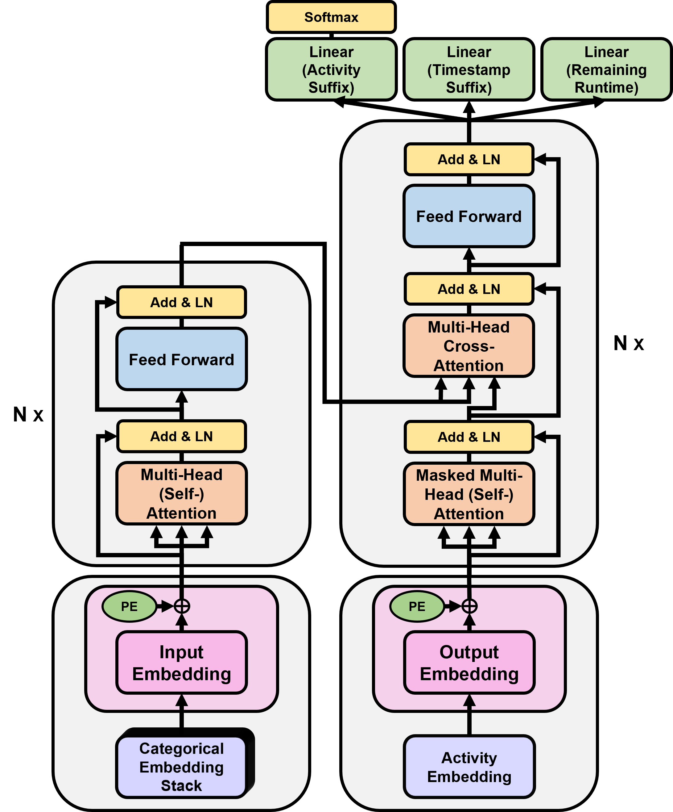
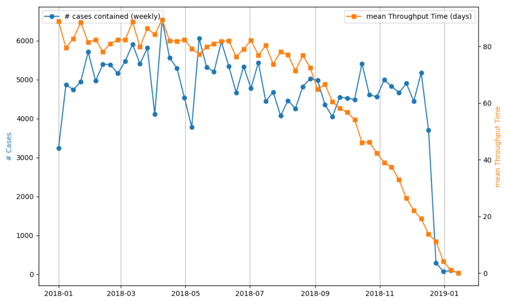

# SuffixTransformerNetwork



___
<!-- Documentation (docstrings and comment lines) SEP-, ED- and CRTP-LSTM benchmark, as well as SuTraN completely finished (14/06/2024). Preprocessing package almost fully documented. **COMING SOON**:
- Fully completed project description (README.md), including detailled descriptions of the inner workings of all benchmarks. 
- pre-trained models and benchmarks 
- Scripts for end-to-end usage, from data preprocessing, to training, to evaluation (for all models). 
- Scripts for loading pre-trained models - could be leveraged for e.g. transfer learning. 
- ...

**TO BE COMPLETED 21/06/2024** -->

> **NOTE**:
>
> At the moment, several latex constructs displaying mathematical constructs are not rendering properly on github. This issue will be resolved soon. At the moment, a previev of the README.md in a local copy of the repository, does render all constructs properly. 
___

Welcome to the official ***SuTraN*** repository, accompanying the paper "**SuTraN: an Encoder-Decoder Transformer for Full-Context-Aware Suffix Prediction of Business Processes**", submitted to the [ICPM 2024](https://icpmconference.org/2024/) conference. This repository is home to ***SuTraN***, a full-context-aware encoder-decoder transformer network specifically engineered for multi-task suffix prediction tasks within the realm of Predictive Process Monitoring (PPM). Unlike traditional approaches, SuTraN can forecast complete event suffixes in a singular forward pass, effectively integrating sequence-to-sequence learning, autoregressive suffix generation, explicit predictions of remaining runtime, and data-awareness. 

This repository contains the source code, pre-trained models, and extensive documentation necessary to use and further develop the ***SuTraN*** model, as well as all benchmark reimplementations. Our goal is to facilitate reproducibility, and thereby fostering an open and collaborative environment where the community can contribute to advancing PPM technology by integrating SuTraN into their workflows, experimenting with the model, or enhancing its capabilities. Accordingly, in addition to the extensive documentation accompanying the code itself, this project description also contains comprehensive explanations of the preprocessing steps, detailed descriptions of all reimplementations, supplementary material, and comprehensive tutorials on how to train and evaluate ***SuTraN***, or the benchmark re-implementations, on your own data. 

In this repository, you will find the complete implementation of SuTraN, including:

- **Comprehensive Preprocessing Steps**: Detailed instructions and scripts for preparing your data, ensuring it is ready for model training.
- **Model Architecture and Training Code**: All the necessary code to train SuTraN on your datasets, with extensive comments and documentation to guide you through the process.
- **Reimplementation of Benchmark Techniques**: For comparative analysis, we provide reimplementations of existing models in the literature, standardized to our preprocessing and evaluation framework.
- **Supplementary Materials**: Additional resources, including evaluation scripts, result visualization tools, and examples of real-life event logs used in our experiments.

We invite you to explore the repository, try out the model, and join us in improving the predictability and efficiency of business processes globally. For more details on the theoretical foundation and experimental validation of SuTraN, please refer to our paper.


## Code Overview 
The table underneath provides an overview of the subdirectories containing the code for each implenmentation included in the experimental setup of the paper, as well as the literature on which these re-implementations were based. 

|    | Implementation   | Subdirectory     | Based on |
| ---| :-----------: |:-------------:| :-------: |
|  1 | [***SuTraN*** ](#sutran)     | ``SuTraN`` | \ |
|  2 | [***SuTraN (NDA)***](#sutran)      | ``SuTraN`` | \ |
|  3 | [*CRTP-LSTM*](#crtp-lstm)    | ``CRTP_LSTM`` | [[1]](#references) |
|  4 | [*CRTP-LSTM (NDA)*](#crtp-lstm)     | ``CRTP_LSTM`` | [[1]](#references) |
|  5 | [*ED-LSTM*](#ed-lstm)    | ``LSTM_seq2seq`` |  (loosely) [[2]](#references) & [[3]](#references)|
|  6 | [*SEP-LSTM*](#ed-lstm) | ``OneStepAheadBenchmarks``     |  [[4]](#references) |

Other packages included in this repository are: 

- ``Preprocessing`` : directory contains all functionality to preprocess the data, as described in the paper. To ensure the creation of unbiased out-of-time train-test splits with data leakage prevention, we implemented the train-test procedure proposed in [[5]](#references). The corresponding code for this train-test split procedure, can be found in the ``Preprocessing\create_benchmarks.py`` module. For more details and illustrations regarding our preprocessing procedure, please refer to the [Preprocessing](#preprocessing) within the project description.  

- `visualization` : contains all code needed for results visualization over the different prefix and suffix lengths for the event logs used in this experiment. The code also allows for the inclusion of an automatic  *'Case-Length De-Noising'* step prior to visualization, as performed in the paper. 

<!-- - `utils` : This subpackage consolidates common functions and methods that are duplicated across different modules and packages within the repository. By centralizing these utilities, we aim to eliminate redundancy and promote code reuse. This subpackage includes functions for efficient evaluation and parallel inference, such as the computation of the normalized Damerau-Levenshtein distance for batches of instances in parallel, using PyTorch tensors. The `utils` subpackage facilitates streamlined development and maintenance, ensuring that frequently used functionality is readily accessible and consistently applied across the project<a id="ref1"></a>[^1]. -->

<!-- - `Evaluation` : general functionality, duplicated in evaluation modules of different benchmarks. For guaranteeing efficient evaluation, we created several functions that allow for parallel inference, e.g. created function for parallel computation of the Damerau-Levensthein distance, over a batch of instances. ...  -->
<!-- ... In progress.  -->

<!-- Here's a statement that needs clarification.<a id="ref1"></a>[^1]

More text with another footnote.<a id="ref2"></a>[^2] -->

[^1]: At the moment, these functions are still duplicated in the subpackages pertaining to different model implementations. In this first version of the repository, we are keeping it this way to ensure that all necessary functionality is self-contained within each subpackage. However, in future versions, the repository could be made even more efficient and modular by fully integrating these centralized functions into the existing subpackages. For now, the `utils` subpackage provides a central location for these utilities, making them readily accessible as stand-alone functions to be used by other researchers and practitioners in the field of Predictive Process Monitoring (PPM). [↩](#ref1)
<!-- [^2]: Here's another explanation for the second footnote. [↩](#ref2) -->

## Data 
Four real-life event logs recording cases of rather unstructured processes were used, three of which are publicly available. The BPIC17-DR event log, as explained in the paper, is derived BPIC17. The characteristics of these event logs after the application of the preprocessing steps, as well as the link towards the publicly available logs, are provided in the Table 1. 


<!-- | Event Log Name | Cases   | Events   | Variants | Activities | Mean - Standard Deviation Case Length  | Mean - Standard Deviation Case Duration  | Event Features | Case Features | URL                                                                         | `start_data` | `end_date` |
|----------------|---------|----------|----------|------------|----------------------------------------|------------------------------------------|----------------|---------------|-----------------------------------------------------------------------------|--------------|------------|
| BPIC17         | 30,078  | 1,109,665| 14,745   | 25         | 36.90 - 14.55                          | 20.52 - 10.81 (days)                     | 8              | 3             | [BPIC17](https://doi.org/10.4121/uuid:5f3067df-f10b-45da-b98b-86ae4c7a310b) |     /        |   2017-01  |
| BPIC17-DR      | 30,078  | 704,202  | 3,592    | 25         | 23.42 - 6.85                           | 20.52 - 10.81 (days)                     | 7              | 3             | [BPIC17](https://doi.org/10.4121/uuid:5f3067df-f10b-45da-b98b-86ae4c7a310b) |     /        |   2017-01  |
| BPIC19         | 181,395 | 986,077  | 5,767    | 39         | 5.44 - 1.78                            | 71.76 - 36.78 (days)                     | 2              | 11            | [BPIC19](https://doi.org/10.4121/uuid:d06aff4b-79f0-45e6-8ec8-e19730c248f1) |   2018-01    |   2019-02  |
| BAC            | 362,563 | 1,767,186| 13,496   | 57         | 4.87 - 2.49                            | 732 - 912.24 (seconds)                   | 1              | 7             | /                                                                           |      /       |      /     | -->

<!-- ---------------------------------------------------------------------------------------------- -->

<figure>
    <table>
        <caption>Table 1: Properties of the Event Logs Incorporated in the Experimental Comparison After Preprocessing. The <code>start_date</code> and <code>end_date</code> parameters are the start and end dates of the event logs imposed for chronological outlier removal during Preprocessing. If no start or end date is specified, the original dates were used.</caption>
        <tr>
            <th>Event Log Name</th>
            <th>Cases</th>
            <th>Events</th>
            <th>Variants</th>
            <th>Activities</th>
            <th>Mean - Standard Deviation Case Length</th>
            <th>Mean - Standard Deviation Case Duration</th>
            <th>Event Features</th>
            <th>Case Features</th>
            <th>URL</th>
            <!-- <th>start_date</th> -->
            <th style="font-family: monospace;">start_date</th>
            <th style="font-family: monospace;">end_date</th>
        </tr>
        <tr>
            <td>BPIC17</td>
            <td>30,078</td>
            <td>1,109,665</td>
            <td>14,745</td>
            <td>25</td>
            <td>36.90 - 14.55</td>
            <td>20.52 - 10.81 (days)</td>
            <td>8</td>
            <td>3</td>
            <td><a href="https://doi.org/10.4121/uuid:5f3067df-f10b-45da-b98b-86ae4c7a310b">BPIC17</a></td>
            <td>/</td>
            <td>2017-01</td>
        </tr>
        <tr>
            <td>BPIC17-DR</td>
            <td>30,078</td>
            <td>704,202</td>
            <td>3,592</td>
            <td>25</td>
            <td>23.42 - 6.85</td>
            <td>20.52 - 10.81 (days)</td>
            <td>7</td>
            <td>3</td>
            <td><a href="https://doi.org/10.4121/uuid:5f3067df-f10b-45da-b98b-86ae4c7a310b">BPIC17-DR</a></td>
            <td>/</td>
            <td>2017-01</td>
        </tr>
        <tr>
            <td>BPIC19</td>
            <td>181,395</td>
            <td>986,077</td>
            <td>5,767</td>
            <td>39</td>
            <td>5.44 - 1.78</td>
            <td>71.76 - 36.78 (days)</td>
            <td>2</td>
            <td>11</td>
            <td><a href="https://doi.org/10.4121/uuid:d06aff4b-79f0-45e6-8ec8-e19730c248f1">BPIC19</a></td>
            <td>2018-01</td>
            <td>2019-02</td>
        </tr>
        <tr>
            <td>BAC</td>
            <td>362,563</td>
            <td>1,767,186</td>
            <td>13,496</td>
            <td>57</td>
            <td>4.87 - 2.49</td>
            <td>732 - 912.24 (seconds)</td>
            <td>1</td>
            <td>7</td>
            <td>/</td>
            <td>/</td>
            <td>/</td>
        </tr>
    </table>
</figure>

### Data - Preprocessing
___
The main functionality, taking as input the event log and an extensive set of parameters, and returning the pytorch tensors representing the train, test and validation instances, is contained within the `log_to_tensors()` function, located in the ``Preprocessing\from_log_to_tensors.py`` module. 

```python 
def log_to_tensors(log, 
                   log_name, 
                   start_date, 
                   start_before_date, 
                   end_date, 
                   max_days, 
                   test_len_share, 
                   val_len_share, 
                   window_size, 
                   mode,
                   case_id = 'case:concept:name', 
                   act_label = 'concept:name', 
                   timestamp = 'time:timestamp',
                   cat_casefts = [], 
                   num_casefts = [], 
                   cat_eventfts = [], 
                   num_eventfts = [], 
                   outcome = None):
```

The consecutive preprocessing steps are illustrated below, at each step referring to relevant the parameters of the `log_to_tensors()` function. For more information on these parameters, please refer to the documentation (docstring) accompanying the `log_to_tensors()` function itself. 

The function returns three tuples of pytorch Tensors, `train_data`, `val_data` and `test_data`, which contain the tensors pertaining to input data and labels of the the training set, validation set and test set respectively. Please refer to [subsection '7. Tensor Creation'](#7-tensor-creation) for a detailled explanation of the tensors contained within these tuples. 

The `log_name` string parameter should be set to a suiting name for the event log for which the datasets are created. During the execution of the `log_to_tensors()` function, a subfolder called `log_name` is created at the working directory from which the function is called. In this subfolder, a number of important dictionaries, as well as two lists are written to disk as pickle files. These variables can (and should) be loaded into memory by executing the following function: 
```python
import pickle
def load_dict(path_name):
    with open(path_name, 'rb') as file:
        loaded_dict = pickle.load(file)
    
    return loaded_dict
```
`path_name` should be the string path pointing towards the location of the dictionary or list to be loaded into memory. The string names of the variables stored within the `log_name` directory, together with explanations on the content of these pickle files, is given in [sub-section '8. Variables to be Loaded into Memory](#8-variables-to-be-loaded-into-memory). 


<!-- 
     - As explained in [subsection '7. Tensor Creation'](#7-tensor-creation), all categorical features pertaining to the prefix events receive their own integer tensor in the train, validation or test tuples. These tensors are stored at indices $\mathit{idx}=0, ..., num^c-1$ of these tuples. The `cat_cols_dict['prefix_df']` list contains the original (string) column names of these $num^c$ categorical features, in the same order in which their respective tensors are stored in the `train_data`, `val_data` and `test_data` tuples. 
     
     - All Non-Data-Aware (NDA) techniques (*SEP-LSTM*, *ED-LSTM*, *SuTraN (NDA)* and *CRTP-LSTM (NDA)*) can only process prefix event tokens consisting of solely the activity label and the two numeric time proxies. Therefore, out of the $num^c$ categorical prefix event feature tensors, only the one pertaining to the activity label should be retained. Due to the way in which the train, validation and test tuples are created, the prefix events' activity labels tensor is always stored at index $num^c-1$. Therefore, one can easily derive the index of this tensor as follows: `num_categoricals_pref = len(cat_cols_dict['prefix_df'])`.  -->
     


     

   <!-- - Python dictionary containing categorical features as keys, and other python dictionaries as values. 
   - For each categorical feature `cat_ft` contained within the `cat_casefts` or `cat_eventfts` list (or the `activity_label` string), `categ_mapping_dict[cat_ft]` contains the following inner dictionary: 
     - *keys*: the string names of all unique levels of categorical feature `cat_ft`
     - *values*: the integer to which each unique level is mapped. 
   - Again, in the final tensors, each mapped integer should be incremented with 1, since index 0 pertains to the added padding index. 
   - There is no key for the $\mathit{EOS}$ token in the inner `categ_mapping_dict[act_label]` dictionary, since the $\mathit{EOS}$ token is only added to the ground-truth activity labels used for training and evaluation. The integer pertaining to the $\mathit{EOS}$ token in the ground-truth activity label tensor is the last index, `num_activities-1`. 
   - Can be used for, e.g., mapping activity label predictions back to the original string names.  -->

#### 1. Unbiased Train-Test splits 
Following Weytjens et al. [[5]](#references), a chronological out-of-time train-test split with data leakage prevention, was implemented.

Before executing the ultimate train-test split, the following steps were carried out: 

1. __Chronological outlier removal__: Certain event logs contained anomalous timestamps (e.g. timestamps dating back to 1948 for BPIC19). Therefore, for certain event logs, only cases starting after or during the month specified by `start_date`, and ending before or during the month specified by `end_data`, were retained. For BPIC17, BPIC17-DR and BPIC19, the months determined in [[5]](#references) were used. 

1. __Duplicate Event Removal__: Completely identical consecutive events (with all attributes, including the timestamp being identical) were removed. This data error was only observed in BPIC19.

1. __Case Duration Outlier Removal__: Cases with anomalously high throughput times (durations) were discarded avoid distorting the Train-Test splits. For BPIC17(-DR) and BPIC19, the case duration cutoff determined in [[5]](#references) was used. Closer inspection revealed the duration cutoffs imposed by [[5]](#references) to fluctuate between the 96th and 98th percentile for the event logs included in their study. Since they did not include the [BAC event log](#data), and due to volatile throughput times recorded within this event log, the BAC duration cutoff was set at the 96th percentile of the throughput time distribution. 

> **Note**
>
>The end of dataset debiasing step recommended by the authors in  [[5]](#references) was omitted since the event logs used did not contain incomplete cases.

After the application of these first preprocessing steps, a 75-25% chronological (out-of-time) train-test split with data leakage prevention was performed. For three event logs, we ahdered to the [*Preferred Train-Test Split procedure*](#1a-preferred-train-test-split-procedure) by Weytjens et al. [[5]](#references). Extraction bias, combined with particular other characteristics of the BPIC19 event log, necessitated the development of a [*Workaround Train-Test Split procedure*](#1b-workaround-train-test-split-procedure) for the latter event log. 


After applying the Train-Test split procedure *(either the [preferred](#1a-preferred-train-test-split-procedure) or [workaround](#1b-workaround-train-test-split-procedure) procedure)*, the last 20% of cases in the training set are separated into the validation set, without additional data leakage prevention, resulting in the final training and validation set. This approach is chosen because the validation set is only used to validate the models after each epoch and to select the final model version after training. Implementing data leakage prevention for the validation set would lead to an unnecessary loss of prefix-suffix pairs. By using a temporal split without data leakage prevention, we maintain the out-of-time characteristic of the test set, ensuring more representative validation criteria for selecting models with the best generalization, while maximizing data retention. 

> **NOTE**
>
> To implement this, the `test_len_share` and `val_len_share` parameters should be set to `0.25` and `0.2` respectively. 

##### 1.a Preferred Train-Test Split procedure
<!-- Following Weytjens et al. [[5]](#references), a chronological out-of-time train-test split with data leakage prevention, was implemented.  -->
Cases were organized based on their start time, and a cutoff point was set at the earliest start time of the last 25% of cases. Consequently, the training set comprised cases completed before this separation point, while the test set consisted of prefixes from the remaining cases. Importantly, for test set cases that began before the cutoff, only prefixes with at least one event occurring after the cutoff were included to avoid overlap between training and test set. This is illustrated in the figure below: 

<p align="center">
  
  <br>
  <b>Figure 1:</b> Preferred Train-Test Split Procedure.
</p>

The overlapping (red-green) cases are assigned to the test set as well. However, upon parsing these overlapping cases into multiple test instances (i.e. prefix-suffix pairs), instances for which the prefix is fully embedded into the red area are discarded. In other words, only the prefix-suffix pairs for which at least one event occurred after separation time are retained. By doing so, none of the test instances are running concurrently with any of the training instances, hence avoiding data leakage, while preserving as much data as possible. 

<!-- Prior to the actual creation of train and test sets, the procudure by [[5]](#references) also discarded cases with anomalously high throughput times (durations), as well as chronological outliers. The duration cutoff determined by [[5]](#references) fluctuated between the 96th and 98th percentile for the event logs included in their study. Since they did not include the [BAC event log](#data), and due to volatile throughput times recorded within this event log, the BAC duration cutoff was set at the 96th percentile of the throughput time distribution.  -->


##### 1.b Workaround Train-Test Split Procedure

For the BPIC19 dataset, an workaround split procedure was required due to a noticeable anomaly observed in the data [[6]](#references). Specifically, from September 2018 onwards, the average throughput time decreased significantly, caused by issues related to the extraction method. This irregularity is believed to stem from the way the event log was extracted. 

More specifically, at the time at which the BPIC19 event log was extracted, all cases still running were discarded, and only finished cases were retained. Given the fact that the event log covers a period of about 1 year, combined with the [significantly high average throughput time](#data), an artificial drift was induced, leading to *"extraction bias"* (Fig. 2). 

<p align="center">
  
  <br>
  <b>Figure 2:</b> <a href="https://github.com/BrechtWts/DyLoPro"><b>DyLoPro</b></a> - (Artificial) Throughput Time Drift BPIC19
</p>

As can be seen in Fig. 2, the chronological train-test split would significantly bias the test set, as this artificial bias would result in the test set containing cases with significantly shorter throughput times compared to the training set. This *"extraction bias"* did not only manifest itself in the throughput time, but in other perspectives as well [[6]](#references).

Therefore, a workaround procedure for the BPIC19 event log was developed. This workaround procedure still applied chronological outlier removal, as well as case duration outier removal, as proposed by [[5]](#references), but additionally removed all cases starting post-September 2018 because of the extraction bias present within the distribution from that point onwards. All cases still running at that time, were retained, thereby mitigating the extraction bias. 

Moreover, given the high average throughput time compared to the period covered by the BPIC19, the preferred train-test set, in which only the cases that have been completed prior to separation time are assigned to the training set, would mirror the same bias in the training set. Therefore, in the workaround procedure applied to the BPIC19, the training set includes prefixes from
cases starting before the cutoff, while the test set encompasses all cases (and hence the prefixes they produce) starting after the cutoff. This is illustrated in Fig. 3. 
<p align="center">
  
  <br>
  <b>Figure 3:</b> Workaround Train-Test Split Procedure - Illustration derived from periodically sampled BPIC19 cases, while zooming in on the period surrounding separation time.
</p>
The overlapping (green-red) cases are now assigned to the training set, instead of the test set. Upon parsing these overlapping cases into training instances (prefix-suffix pairs), only prefix-suffix pairs of which the prefix only contains events recorded pre-separation time (green prefixes) are retained. By doing so, these training instances' prefixes are not influenced by any of the test set instances. The ground-truth suffix events pertaining to these green prefixes are however partly recorded post-separation time, and might therefore partly be influenced by concurrently running cases in the test set. Since these suffixes are used as labels for training the data, minor data leakage might still be retained, an insurmountable compromise for obtaining representative BPIC19 training and test sets. 

Finally, Fig. 3 also illustrates the bias that would be induced in the BPIC19 training set in case of the preferred train-test setup. In the preferred train-test setup, prefixes derived from the green-red overlapping cases would be assigned to the test set, resulting in only the shorter light-blue being contained within the training set. 

> **Note**
>
> This workaround setup can also be applied to other event logs exhibiting similar characteristics not covered in this study, particularly those with a high *average throughput time* to *event log time period* ratio and the same extraction-induced drifts. To implement this, specify `mode = 'workaround'` in the `log_to_tensors()` function and provide an appropriate date for the `start_before_date` parameter. For example, for BPIC19, set `start_before_date = 2018-09`.


#### 2. Case Length Outlier Removal

We further excluded the top 1.5% of cases with the highest number of events to mitigate their disproportionate impact. These outliers would have required excessively long sequence lengths for training, leading to increased computational costs and unnecessary complexity. Notably, the additional number of cases discarded by this step was limited, as most outliers were already removed by [*Case Duration Outlier Removal*](#1-unbiased-train-test-splits).

This was achieved by setting the `window_size` parameter to the 98.5th percentile of the case length distribution.

#### 3. Preprocessing Categorical Features 
Each categorical feature (specified in the `cat_casefts` or `cat_eventfts` list, and the activity label specified for the `act_label` parameter) is preprocessed as follows:

1. In case missing values are present in either the train or test set, or in both, all missing values are mapped to an additional `'MISSINGVL'` category. 
1. To closely mirror real-life scenarios in which new categories appear after training (such as new employees resulting in a new 'resource' category when the trained models are already deployed), an additional *'Out Of Vocabulary' (OOV)* category is added. All test set categories not seen in the training set are replaced by the same `OOV` level. It should be noted that an `OOV` level is always included, even if the test set does not contain levels unseen in the training set. This approach anticipates real-world deployment, ensuring the models can handle new categories without breaking down.
1. All distinct levels present in the training set are mapped to unique integers, which will serve as the inputs to the dedicated learned Embeddings of all models. 

#### 4. Create Numeric Timestamp Proxies 
For training, validation and test set, four numeric event features relating to the timestamp information are derived for each event:
1. *Time elapsed since previous event* $t_j^p$: Time elapsed since the previous event recorded for the same case. For the first event of each case, this value is set to 0. 
1. *Time elapsed since case start* $t_j^s$: Time elapsed since case start, i.e. the first event recorded for that particular case. For the first event, this value is set to 0. 
1. *Time till next event*: Time remaining until the next event pertaining to the same case. For the last event of each case, this value is set to one. These values are equal to the *time elapsed since start* feature, shifted one to the left. This feature is will only be used to derive the ground-truth timestamp suffix for each prefix-suffix pair in the [Prefix-Suffix Creation](#5-prefix-suffix-creation) step. 
1. *Remaining Runtime* $r_j$: TIme remaining until case completion (i.e. until the last event of that particular case). These values will not be used as features, but as the remaining runtime target. 

All four features are expressed in seconds. 

> **Note:**
>
> In the paper, the timestamp suffixes to be predicted were referred to as the suffixes of *time elapsed since previous event*. In the code and documentation, we talk about *time till next event* ('TTNE'). They are the exact same concept however, since, for each timestamp (within the timestamp suffix), 'TTNE' *(in the code)* is perceived from the last observed suffix event, while *time elapsed since previous event* in the paper is perceived from the to-be predicted next event. 

#### 5. Prefix-Suffix Creation 
In this step, we create prefix-suffix pairs from the event log data. This process involves generating all possible prefixes for each case in the event log and the corresponding suffixes. During this phase, overlapping prefixes (and their corresponding suffixes) are deleted as indicated in [step 1](#1-unbiased-train-test-splits). This step results in four dataframes for the train, validation and test set: 
1. `prefix_df`: dataframe containing all the generated prefixes. 
1. `suffix_df`: dataframe containing all corresponding input suffixes. These will be used as the suffix event tokens needed by **SuTraN** and the *ED-LSTM* benchmark implementation (as inputs for their respective decoders), which during training, are given to them (teacher forcing). Upon inference (and hence for both the validation and test sets), these input suffixes are not needed, since both models will produce suffixes auto-regressively, deriving new suffix event tokens after every consecutive suffix prediction. 
1. `timeLabel_df`: dataframe containing the ground-truth timestamp suffix, and remaining runtime suffix labels pertaining to the generated prefixes (and suffixes). While SuTraN is only trained to directly predict the remaining runtime given a prefix, the CRTP-LSTM is trained for predicting entire remaining runtime suffixes. Therefore, remaining time suffixes instead of scalars are generated. 
1. `actLabel_df`: dataframe containing the ground-truth activity label suffixes. Each ground-truth suffix is appended with a final `END` token to denote the end of a case, allowing models to learn when cases end.

Mathematically, each case ${\sigma}=\langle {e}_1, \dots, {e}_n \rangle$ is parsed into $n$ prefix event token sequences $\tilde{\sigma}_k^p \ (k\in \{1, \dots, n\})$. Each prefix $\tilde{\sigma}_k^p$ is accompanied by the ground-truth activity and timestamp suffix targets, as well as a scalar remaining time target. However, to cater for the training mechanism implemented in the *CRTP-LSTM* benchmark, entire remaining runtime suffixes are derived. For training **SuTraN**, as well as for evaluating the remaining runtime predictions of all models, including *CRTP-LSTM*, only the first scalar remaining runtime target is needed. Furthermore, to enable teacher forcing for **SuTraN** (as well as for *ED-LSTM*), corresponding suffix event token sequences $\tilde{\sigma}_k^s = \langle {e}_k^s, {e} _{k+1}^{s}, ..., {e}_n^s \rangle$ were generated for each prefix $\tilde{\sigma}_k^p$.

Following the notation used in the paper, the parsing of a case into prefix-suffix pairs can be illustrated by means of the following example. Let ${\sigma}=\langle {e}_1, \dots, {e}_4 \rangle$ be a case of length $4$. 

**Table 2**: Prefix-Suffix Creation - Example 
| $k$ | prefix event token sequence $\tilde{\sigma}_k^p$ | suffix event token sequence $\tilde{\sigma}_k^s$| Activity Suffix (Targets) | Timestamp Suffix (Targets) | Remaining Time (Target) | Remaining Runtime Suffix Targets |
|---|---|---|---|---|---|---|
| 1 | $\langle {e}^p_1 \rangle$ | $\langle {e}_1^s, {e}_2^s, {e}_3^s, {e}_4^s \rangle$ | $\langle a_2, a_3, a_4, \mathit{EOS} \rangle$ | $\langle t^p_2, t^p_3, t^p_4, 0 \rangle$ | $r_1$ | $\langle r_1, r_2, r_3, 0 \rangle$ |
| 2 | $\langle {e}^p_1, {e}^p_2 \rangle$ | $\langle {e}_2^s, {e}_3^s, {e}_4^s \rangle$ | $\langle a_3, a_4, \mathit{EOS} \rangle$ | $\langle t^p_3, t^p_4, 0 \rangle$ | $r_2$ | $\langle r_2, r_3, 0 \rangle$ |
| 3 | $\langle {e}^p_1, {e}^p_2, {e}^p_3  \rangle$ | $\langle {e}_3^s, {e}_4^s \rangle$ | $\langle a_4, \mathit{EOS} \rangle$ | $\langle t^p_4, 0 \rangle$ | $r_3$ | $\langle r_3, 0 \rangle$ |
| 4 | $\langle {e}^p_1, {e}^p_2, {e}^p_3, {e}^p_4  \rangle$ | $\langle {e}_4^s \rangle$ | $\langle \mathit{EOS} \rangle$ | $\langle 0 \rangle$ | $0$ | $\langle 0 \rangle$ |


Each suffix event token $e_j^s \ = \ (a_j, t_j^p, t_j^s)$ is comprised of an (integer-encoded) activity label, the *time elapsed since the previous event*, and the *time elapsed since case start*. As can be seen in **Table 2**, the first suffix event token ${e}_k^s$ for each instance (prefix-suffix pair), based on which SuTraN's decoder starts the AR generation of the to-be generated activity and timestamp suffixes, is populated with the activity label and the two numeric time proxies of the last observed prefix event, serving as the multi-modal proxy of the *Start Of Sequence (SOS)* token in NLP. As such, each *suffix event token sequence* contains $n-k+1$ suffix events. As already mentionned, it is used for teacher forcing during training, providing the decoder the ground-truth suffix events (shifted 1 to the right). Upon inference, only the first suffix event token *(SOS proxy)* is given to SuTraN's decoder, after which it derives a new suffix event token at each consecutive decoding step, based on its activity and timestamp prediction. 

#### 6. Preprocessing Numerical Features & Targets 
After creating the prefix-suffix pairs, we standardize the numerical features **and targets**. This step occurs after the prefix-suffix creation process and ensures that the MAE loss functions for remaining runtime and timestamp suffix prediction are on a scale more similar to the one of the categorical cross-entropy loss function. Standardization is performed using the mean and standard deviation of the training data, transforming the features to have a mean of 0 and a standard deviation of 1. This normalization process helps in stabilizing and accelerating the training process, ensuring that the model does not become biased towards features with larger numerical ranges. By standardizing the targets as well, we ensure that the gradient descent steps are not disproportionately influenced by the disproportionate magnitude of the MAE in seconds, relative to the categorical cross-entropy losses for activity suffix prediction. After standardization of all features, possible missing values were imputed with $0$, and an additional binary indicator feature was added, evaluating to $1$ if a missing value was observed, and $0$ otherwise. 

#### 7. Tensor Creation:
Finally, a separate tuple consisting of pytorch tensors was created for the training, validation and test set. However, to cater for prefixes and suffixes of varying lengths, right-padding was used for all tensors. 

The main `log_to_tensors()` returns, i.a., three tuples: `train_data`, `val_data` and `test_data`, each comprised of the same amount of tensors, containing the training, validation, and test instances respectively. 

Let:
- $num^c$ be the number of categorical features, including the activity labels (and hence the total number of features specified in the `cat_casefts` and `cat_eventfts`, plus one for the activity label).
- $num^n$ be the number of numerical features, including the two numerical time proxies ($t_j^p$ and $t_j^s$) derived [earlier](#4-create-numeric-timestamp-proxies), as well as the additional binary indicators added in [step 6](#6-preprocessing-numerical-features--targets) for numeric features with missing values (if any).
<!-- (and hence the total number of features specified in the `num_casefts` and `num_eventfts`, plus two).  --> 
- $N_{\mathit{train}}$, $N_{\mathit{val}}$ and $N_{\mathit{test}}$ be then number of prefix-suffix pairs (i.e. instances) derived for the train, validation and test set respectively. 
- $W$ be the maximum sequence length (i.e. `window_size`)
- $k_i$ be the prefix length of instance *(aka prefix-suffix pair)* $i$ $(i=0, ..., N-1)$.
- $n_i$ be the case length of the original case ${\sigma}=\langle e_1, \dots, e_{n_i} \rangle$ that prefix-suffix pair $\{\tilde{\sigma} _{k _i}^p,\tilde{\sigma} _{k_i}^s\}$ is derived from. Consequently, every sequence of prefix event tokens $\tilde{\sigma} _{k_i}^p$ of length $k _i$ is accompanied by a sequence of suffix event tokens $\tilde{\sigma} _{k_i}^s$ of length $n_i-k_i+1$. 

The following *[PyTorch](https://pytorch.org/)* tensors are contained at each index $\mathit{idx}$, e.g., for the `train_data` tuple, `train_data[idx]` contains:

- <u>Sequence of Prefix Event Token</u>:
  - $\mathit{idx}=0, ..., num^c-1$: 
    - $(N_{\mathit{train}}, W)$-shaped tensor of dtype `torch.int64`
    - containing for each instance $i \ (=0, ..., N_{\mathit{train}}-1)$  the integer-encoded categorical level of a particular categorical feature, for each of its $k_i$ prefix events. For categorical case features, `train_data[idx][i, 0]` $=$ `train_data[idx][i, 1]` $= \ ... \ =$ `train_data[iidx][idx, k_i-1]`. For categorical event features, these integers can vary. 
    - The $W-k_i$ last values alongside the trailing sequence dimension, contain the padding tokens, which are represented by integer $0$. These integers are ingored by the embeddings, producing $0$-filled embedding vectors upon encountering them. 
    - The tensor containing the activity labels of the prefix event tokens is always positioned last, at $\mathit{idx}=num^c-1$.
  - $\mathit{idx}=num^c$: 
    - $(N_{\mathit{train}}, W, num^n)$-shaped tensor of dtype `torch.float32`
    - contains for each of the $k_i$ prefix events of each instance $i \ (=0, ..., N_{\mathit{train}}-1)$ all $num^n$ numeric prefix event features along its trailing dimension. If, e.g., the second numeric feature (index $1$) is a case feature, then `train_data[idx][i, 0, 1]` $=$ `train_data[idx][i, 1, 1]` $= \ ... \ =$ `train_data[idx][i, k_i-1, 1]`. 
    - For all $num^n$ numeric features, the $W-k_i$ last values alongside the central sequence dimension, contain the padding values, which are represented by $0$ for numerical features as well. 
  - $\mathit{idx}=num^c+1$: 
    - $(N_{\mathit{train}}, W)$-shaped tensor of dtype `torch.bool`
    - Contains the boolean padding mask. For each instance $i \ (=0, ..., N_{\mathit{train}}-1)$, the last $W-k_i$ entries (`train_data[idx][i, k_i:]`) evaluate to `True`, telling SuTraN that it is dealing with padding tokens, and that these prefix event tokens should be masked in the encoder's self-attention layers, as well as the decoder's cross-attention layers. 
    - Since *SEP-, ED- and CRTP-LSTM* rely on LSTM layers instead of attention, these tensors are not fed to these models. 
- <u>Sequence of Suffix Event Token</u>:
  - $\mathit{idx}=num^c+2$: 
    - $(N_{\mathit{train}}, W)$-shaped tensor of dtype `torch.int64`
    - Contains, for each instance $i \ (=0, ..., N_{\mathit{train}}-1)$ the integer-encoded activity labels of the $n_i-k_i+1$ suffix event tokens (at entries `train_data[idx][i, :n_i-k_i]`) alongside the trailing dimension. 
    - The last $W - (n_i - k_i + 1)$ entries (`train_data[idx][i, n_i-k_i:]`) are filled with padding tokens (integer $0$). 
  - $\mathit{idx}=num^c+3$: 
    - Contains, for each instance $i \ (=0, ..., N_{\mathit{train}}-1)$ the numeric timestamp proxies $(t_j^s, t_j^p)$ of the $n_i-k_i+1$ suffix event tokens (at entries `train_data[idx][i, :n_i-k_i, :]`).
    - The last $W - (n_i - k_i + 1)$ (`train_data[idx][i, n_i-k_i:, :]`) are filled with padding values (float $0$). 

- <u>Ground-truth Target Sequences</u>:

  - $\mathit{idx}=num^c+4$: 
    - $(N_{\mathit{train}}, W, 1)$-shaped tensor of dtype `torch.float32`
    - Contains, for each instance $i \ (=0, ..., N_{\mathit{train}}-1)$ the timestamp suffix targets $\langle t^p_{k_i+1}, ..., t^p_{n_i}, 0 \rangle$ used for training and evaluating timestamp suffix predictions. 
    - The last $W - (n_i - k_i + 1)$ targets are set to the padding value of -100, used for masking timestamp prediction errors pertaining to padding suffix event tokens, ensuring they do not contribute to the loss computations. 

  - $\mathit{idx}=num^c+5$: 
    - $(N_{\mathit{train}}, W, 1)$-shaped tensor of dtype `torch.float32`
    - Contains, for each instance $i \ (=0, ..., N_{\mathit{train}}-1)$ the remaining runtime suffix targets $\langle r_{k_i}, ..., r_{n_i-1}, 0 \rangle$. 
    - Used for training *CRTP-LSTM* to predict remaining runtime suffixes.
    - Only the first remaining runtime value $r_{k_i}$ is subsetted for training **SuTraN**, as well as for evaluating **SuTraN** and all other benchmarks, including *CRTP-LSTM*. 
    - The last $W - (n_i - k_i + 1)$ targets are set to the padding value of -100, used for masking remaining runtime prediction errors pertaining to padding suffix event tokens, ensuring they do not contribute to the loss computations for the *CRTP-LSTM* benchmark. 

  - $\mathit{idx}=num^c+6$: 
    - $(N_{\mathit{train}}, W, 1)$-shaped tensor of dtype `torch.int64`
    - Contains, for each instance $i \ (=0, ..., N_{\mathit{train}}-1)$ the activity suffix targets $\langle a_{k_i+1}, ..., a_{n_i}, \mathit{EOS} \rangle$. 
    - Used for training and evaluating activity suffix predictions. 
    - The last $W - (n_i - k_i + 1)$ targets are set to the padding integer of 0, used for masking activity predictions pertaining to padding suffix event tokens, ensuring they do not contribute to the loss computations. 

The `val_data` and `test_data` tuples are structured identically, with the first dimension shared across all tensors being equal to respectively $N_{\mathit{val}}$ and $N_{\mathit{test}}$, instead of $N_{\mathit{train}}$. 

During training and inference, DataLoader instances are created from these tuples, parsing the original tuples along the outermost dimensions $N$ into multiple tuples of batch size $B$. These batches are formatted identically, except for the outermost dimension being of size $B$ instead of $N$. For all implementations, the order of the instances is reshuffled after every epoch before the creation of batches. 


In contrast to **SuTraN**, all benchmarks require the tensors pertaining to the *Sequence of Prefix Event tokens* to be left-padded instead of right-padded. Moreover, each benchmark also has its own additional data formatting requirements due to their modelling setup differences. Therefore, the [SEP-](#sep-lstm), [ED-](#ed-lstm) and [CRTP-](#crtp-lstm)LSTM packages all contain a dedicated module for converting the **SuTraN** data representation discussed here, in the format required for training and evaluating each benchmark. See infra. 

To ensure consistency when re-opening the repository, and to increase efficiency, it is recommended to write these three tuples to disk. Thereby, having to re-execute the entire `log_to_tensors()` function, which can take up to a couple of minutes each time, is avoided. 

This can be done by executing the code underneath, which stores the `train_data`, `val_data` and `test_data` tuples in the same directory `log_name`, in which the variables discussed in [subsection 8](#8-variables-to-be-loaded-into-memory) are stored. 

```python
import os
import torch

log_name = 'FILL IN HERE'

# Create the log_name subfolder in the root directory of the repository
# (Should already be created when having executed the `log_to_tensors()`
# function.)
output_directory = log_name
os.makedirs(output_directory, exist_ok=True)

# Save training tuples
train_tensors_path = os.path.join(output_directory, 'train_tensordataset.pt')
torch.save(train_data, train_tensors_path)

# Save validation tuples
val_tensors_path = os.path.join(output_directory, 'val_tensordataset.pt')
torch.save(val_data, val_tensors_path)

# Save test tuples
test_tensors_path = os.path.join(output_directory, 'test_tensordataset.pt')
torch.save(test_data, test_tensors_path)
```

The `log_name` parameter should be set to the same string specified for the `log_name` parameter passed on to the `log_to_tensors()` function. 

When re-opening the repository, the tuples comprised of the training set, validation set and test set tensors can be loaded back into memory by executing the following code:

```python 
import torch
train_data = torch.load(train_tensors_path)
val_data = torch.load(val_tensors_path)
test_data = torch.load(test_tensors_path)
```


#### 8. Variables to be Loaded into Memory
As already mentioned in the beginning of the [Data](#data) section, after having executed the `log_to_tensors()` function, a subfolder called `log_name` is created, in which a number of important variables are written to disk as `pickle` files. The reason for writing these variables to disk, instead of just returning them, is that the execution `log_to_tensors()` function can take a couple of minutes. Given the importance of these variables, it would be inefficient to reconstruct the data each time the repository is opened again. Using the `load_dict()` function given earlier, the following variables should be loaded into memory: 

1. `log_name + _cardin_dict.pkl`: 
   - `cardin_dict = load_dict(path_name)`
   - Python dictionary containing categorical features as keys, and integer cardinalities pertaining to each categorical feature as values. 
   - The actual cardinality of each categorical feature `cat_ft` contained within the `cat_casefts` or `cat_eventfts` list (or the `activity_label` string) in the eventual tensors is equal to `cardin_dict[cat_ft]+1`, accounting for the additional padding token included within the final tensors. 
   - The number of possible next activities to predict, referred to as the `num_activities` integer parameter in all model implementations, can be derived as `num_activities = cardin_dict[cat_ft]+2`. It should be incremented with 2 instead of one since the ground-truth activity labels not only contain an additional padding token (at index 0), but also an additional End-Of-Sequence $\mathit{EOS}$ token at the last index. 

1. `log_name + _categ_mapping.pkl`: 
   - `categ_mapping_dict = load_dict(path_name)`
   - Python dictionary containing categorical features as keys, and other python dictionaries as values. 
   - For each categorical feature `cat_ft` contained within the `cat_casefts` or `cat_eventfts` list (or the `activity_label` string), `categ_mapping_dict[cat_ft]` contains the following inner dictionary: 
     - *keys*: the string names of all unique levels of categorical feature `cat_ft`
     - *values*: the integer to which each unique level is mapped. 
   - Again, in the final tensors, each mapped integer should be incremented with 1, since index 0 pertains to the added padding index. 
   - There is no key for the $\mathit{EOS}$ token in the inner `categ_mapping_dict[act_label]` dictionary, since the $\mathit{EOS}$ token is only added to the ground-truth activity labels used for training and evaluation. The integer pertaining to the $\mathit{EOS}$ token in the ground-truth activity label tensor is the last index, `num_activities-1`. 
   - Can be used for, e.g., mapping activity label predictions back to the original string names. 

1. `log_name + _num_cols_dict.pkl`: 
   - `num_cols_dict = load_dict(path_name)`
   - Python dictionary containing the three strings `'prefix_df'`, `'suffix_df'` and `'timeLabel_df'` as its three keys, and lists of strings as the corresponding values. Primarily the list pertaining to the `'prefix_df'`, i.e. `num_cols_dict['prefix_df']` is of interest. 
     - As explained in [subsection '7. Tensor Creation'](#7-tensor-creation), all numeric features pertaining to the prefix are contained within one specific tensor. The list `num_cols_dict['prefix_df']` contains the original string names of these numeric features, in the order in which these feature values are stored along the trailing dimension of that particular tensor. This also includes the strings `'ts_start'` and `'ts_prev'`, representing the two numeric timestamp proxies, the *time elapsed since previous event* $t_j^p$ and the *time elapsed since case start* $t_j^s$ *(see [infra](#4-create-numeric-timestamp-proxies))*. 
     - All Data-Aware (DA) models (***SuTraN*** and *CRTP-LSTM*) need to be given, i.a., a `num_numericals_pref` parameter upon initialization. This parameter should be set to the number of numeric features contained within each prefix event token. This could be derived as follows: `num_numericals_pref = len(num_cols_dict['prefix_df'])`. 
     - All Non-Data-Aware (NDA) techniques (*SEP-LSTM*, *ED-LSTM*, *SuTraN (NDA)* and *CRTP-LSTM (NDA)*) can only process prefix event tokens consisting of solely the activity label and the two numeric time proxies. Therefore, the [tensor containing the numeric prefix event features](#7-tensor-creation), i.e. the tensor pertaining to $\mathit{idx}=num^c$, should be subsetted such that only the two numeric time features ($t_j^s$ and $t_j^p$) are retained. To do so, the indices of these two timestamp should be retrieved. Due to the way in which this tensor is created, along its trailing dimension, the *time elapsed since previous event* $t_j^p$ feature is always stored at the index directly after the *time elapsed since case start* $t_j^s$ feature. Therefore, it suffices to retrieve the index of the latter: `tss_index = num_cols_dict['prefix_df'].index('ts_start')`.

1. `log_name + _cat_cols_dict.pkl`: 

   - `cat_cols_dict = load_dict(path_name)`

   - Python dictionary containing the three strings `'prefix_df'`, `'suffix_df'` and `'actLabel_df'` as its three keys, and lists of strings as the corresponding values. Primarily the list pertaining to the `'prefix_df'`, i.e. `cat_cols_dict['prefix_df']` is of interest. 

     - As explained in [subsection '7. Tensor Creation'](#7-tensor-creation), all categorical features pertaining to the prefix events receive their own integer tensor in the train, validation or test tuples. These tensors are stored at indices $\mathit{idx}=0, ..., num^c-1$ of these tuples. The `cat_cols_dict['prefix_df']` list contains the original (string) column names of these $num^c$ categorical features, in the same order in which their respective tensors are stored in the `train_data`, `val_data` and `test_data` tuples. 
     
     - All Non-Data-Aware (NDA) techniques (*SEP-LSTM*, *ED-LSTM*, *SuTraN (NDA)* and *CRTP-LSTM (NDA)*) can only process prefix event tokens consisting of solely the activity label and the two numeric time proxies. Therefore, out of the $num^c$ categorical prefix event feature tensors, only the one pertaining to the activity label should be retained. Due to the way in which the train, validation and test tuples are created, the prefix events' activity labels tensor is always stored at index $num^c-1$. Therefore, one can easily derive the index of this tensor as follows: `num_categoricals_pref = len(cat_cols_dict['prefix_df'])`. 

1. `log_name + _train_means_dict.pkl` & `log_name + _train_std_dict.pkl`: 

   - Let `path_name_means_dict` and `path_name_std_dict` be the string path names pertaining to the two pickle files. 

   - `train_means_dict, train_std_dict = load_dict(path_name_means_dict), load_dict(path_name_std_dict)`

   - `train_means_dict` and `train_std_dict` are both python dictionaries containing the three strings `'prefix_df'`, `'suffix_df'` and `'timeLabel_df'` as their three keys, and lists of floats as the corresponding values. 

   - As explained in [subsection '6. Preprocessing Numerical Features & Targets'](#6-preprocessing-numerical-features--targets), all numeric features, as well as the ground-truth targets, are standardized based on the training set means and standard deviations. These training means and standard deviations used for standardization are stored within the `train_means_dict` and `train_std_dict` respectively. 

   - `train_means_dict['prefix_df']` & `train_std_dict['prefix_df']`: 

     - a list of $num^n$ training means and standard deviations pertaining to the $num^n$ numeric prefix event features. 
     - The order in which these means and standard deviations are stored corresponds to the order in which these feature names are stored in the `num_cols_dict['prefix_df']` list, and hence also to the order in which these feature values are stored along the trailing dimension of that respective tensor. 

   - `train_means_dict['suffix_df']` & `train_std_dict['suffix_df']`: 
     - The suffix event tokens *(used for SuTraN and ED-LSTM)* are comprised of an activity label, the *time elapsed since case start* $t_j^s$ and *time elapsed since previous event* $t_j^p$. The latter two numerics are stored in the [tensor pertaining to index](#7-tensor-creation)  $\mathit{idx}=num^c+3$. 

     - As such, `train_means_dict['suffix_df']` and `train_std_dict['suffix_df']` both give you a list of two floats, pertaining to respectively the training means and standard deviations of these two timestamp numerics of the suffix event tokens. 

     - They are used for e.g. de- and re-standardizing suffix event tokens, for converting predictions into new suffix event tokens during AR inference (with ***SuTraN*** and *ED-LSTM*). For more details, please refer to [Appendix A](#appendix-a---auto-regressive-ar-inference-with-sutran). 

   - `train_means_dict['timeLabel_df']` & `train_std_dict['timeLabel_df']`: 

     - As mentioned in [sub-section '5. Prefix-Suffix Creation'](#5-prefix-suffix-creation) and [sub-section '6. Preprocessing Numerical Features & Targets'](#6-preprocessing-numerical-features--targets), two ground-truth time label suffixes, the ground-truth timestamp suffixes and the ground-truth remaining runtime suffixes, are created and also standardized. 

     - As such, `train_means_dict['timeLabel_df']` and `train_std_dict['timeLabel_df']` both give you a list of two floats, pertaining to respectively the training means and standard deviations of these two timestamp targets of the suffix event tokens. 

     - `train_means_dict['timeLabel_df'][0]` and `train_std_dict['timeLabel_df'][0]` give you the training mean and standard deviation used for standardizing the ground-truth timestamp suffixes. As such, it can be used to de-standardize the timestamp suffix labels, but also the timestamp suffix predictions, back to the original scale in seconds *(e.g. [see Appendix A](#appendix-a---auto-regressive-ar-inference-with-sutran))*.

     - `train_means_dict['timeLabel_df'][1]` and `train_std_dict['timeLabel_df'][1]` give you the training mean and standard deviation used for standardizing the ground-truth remaining time. As such, it can be used to de-standardize the remaining runtime labels, but also the remaniing runtime predictions, back to the original scale in seconds *(e.g. [see Appendix A](#appendix-a---auto-regressive-ar-inference-with-sutran))*.

1. `log_name + _cardin_list_prefix.pkl`:
   - `cardinality_list_prefix = load_dict(path_name)`

   - Python list of integers. 

   - Contains the cardinalities of all $num^c$ categorical features in the prefix event tokens. These integer cardinalities are stored in the same order in which the feature names are stored in the `cat_cols_dict['prefix_df']` list. 

   - This list of integers should be specified when initializing the Data-Aware (DA) models (***SuTraN*** and *CRTP-LSTM*), to construct dedicated embeddings for each prefix categorical. 

   - Note: one can alternatively also derive this list by extracting the values in the `cardin_dict` dictionary. 

## Implementations 
All implementations process a sequence of prefix event tokens $\langle e^p_1,..., e^p_k \rangle$, representing the observed events in an ongoing bussiness process instance, and use this to generate the following set of predictions:

$$\pi(o^p_k) = 
\begin{cases}
    \langle \hat{a}_{k+1},\dots,\hat{a}_{k+D-1}, \mathit{EOS} \rangle & \text{\textit{(1. activity suffix)}} \\
    \langle \hat{t}_{k+1}^p,\dots,\hat{t}_{k+D-1}^p \rangle & \text{\textit{(2. timestamp suffix)}} \\
    \hat{r}_k & \text{\textit{(3. remaining time)}}
\end{cases}$$

The manner in which these predictions are generated however, depends on the implementation itself. **Table 3** provides an overview of the re-implemented benchmarks, and SuTraN, together with their core characteristics. 

***SuTraN*** and *CRTP-LSTM* are the only two Data-Aware (DA) techniques. As such, they are capable of utilizing all available features, including dynamic event features, in the prefix event tokens. As such, and in line with *Def. 3* in the paper, each prefix event token $e^p_j \ (\in \tilde{\sigma} _ k^p)$ processed by these two techniques can be represented as: 

$$
e^p_j = \big( a_j, t^p_j, t^s_j, (\mathit{cf}^{c}_{1,j}, ..., \mathit{cf}^{c}_{m_1^c,j}), (\mathit{ef}^c_{1,j}, ..., \mathit{ef}^{c}_{m_2^c,j}),
(\mathit{cf}^{n}_{1,j}, ..., \mathit{cf}^{n}_{m_1^n,j}), (\mathit{ef}^{n}_{1,j}, ..., \mathit{ef}^{n}_{m_2^n,j}) \big)
$$

with: 
- $a_j$: (integer-encoded) activity label of the $j$-th prefix event.
- $t^p_j$: time elapsed since previous event (standardized).
- $t^s_j$: time elapsed since case start (standardized).
- $(\mathit{cf}^{c} _{1,j}, ..., \mathit{cf}^{c} _{m_1^c,j})$: the constant (integer-encoded) values of the $m_1^c$ categorical case features
- $(\mathit{ef}^c_{1,j}, ..., \mathit{ef}^{c}_{m_2^c,j})$: the dynamic (integer-encoded) values of the $m_2^c$ categorical event features, pertaining to the $j$-th prefix event. 
- $(\mathit{cf}^{n} _{1,j}, ..., \mathit{cf}^{n} _{m_1^n,j})$: the constant (standardized) values of the $m_1^n$ numerical case features. 
- $(\mathit{ef}^{n} _{1,j}, ..., \mathit{ef}^{n} _{m_2^n,j})$: the dynamic (standardized) values of the $m_2^n$ numeric event features, pertaining to the $j$-th prefix event. 

All Non-Data-Aware (NDA) techniques, including **SuTraN (NDA)** and *CRTP-LSTM (NDA)*, only leverage the activity label, and the two timestamp proxies. Accordingly, each NDA prefix event token $e^p_j \ (\in \tilde{\sigma}_k^p)$ can be represented as follows $e^p_j \ = \ (a_j, t_j^p, t_j^s)$. 


**Table 3**: Overview of the Models Included in the Experimental Comparison
| Benchmark                    | Parameters | AR Inference | seq2seq | Encoder-Decoder | DA        | Explicit RT prediction | Explicit timestamp prediction |
|------------------------------|------------|--------------|---------|-----------------|-----------|------------------------|-------------------------------|
| SEP-LSTM                     | 213726     | ✓            | ✗       | ✗               | ✗         | ✗                      | ✓                             |
| CRTP-LSTM *(NDA)*            | 98459      | ✗            | ✓       | ✗               | ✗         | ✓                      | ✗                             |
| CRTP-LSTM                    | 117375     | ✗            | ✓       | ✗               | ✓         | ✓                      | ✗                             |
| ED-LSTM                      | 241771     | ✓            | ✓       | ✓               | ✗         | ✗                      | ✓                             |
| *SuTraN* *(NDA)*             | 121004     | ✓            | ✓       | ✓               | ✗         | ✓                      | ✓                             |
| *SuTraN*                     | 125723     | ✓            | ✓       | ✓               | ✓         | ✓                      | ✓                             |


To ensure a rigorous, fair and controlled assessment of SuTraN’s performance against existing techniques and to compare different modeling setups, we re-implemented various techniques from scratch, maintaining uniformity in data preprocessing and scaling across all benchmarks. Therefore, minor modifications were implemented for 

Accordingly, all techniques, before passing on prefix event embeddings to the sequential layers (LSTM or Transformer layers), process the prefix event tokens identically. More specifically, each categorical feature is processed by a dedicated learned embedding, with each embedding layer's dimensionality determined by the same rule of thumb (*see paper*). For NDA techniques, this only involves a learned embedding for the activity label. The embedding vectors are then concatenated together with the numeric features.

In what follows, all implementations are elaborated on in more detail.

<!-- **FIRST STILL SAY SOMETHING ABOUT THE COMMONALITIES, E.G. BETWEEN ALL AR INFERENCE TECHNIQUES IN INFERENCE - until EOS token or until predefined maximum. Padding predictions after EOS token index for ts suffix and activity suffix etc, ... clamping, ... Enforcing stuff**

Introduce that as follows: "Before going into more detail on the ..., first some common stuff ay..." -->

### SuTraN 
---
<p align="center">
  
  <br>
  <b>Figure 4:</b> SuTraN - architecture
</p>

***SuTraN*** is a full-context-aware encoder-decoder Transformer network tailored for multi-task suffix prediction in predictive process monitoring (PPM). It overcomes the limitations of existing methods by predicting entire event suffixes in a single forward pass. SuTraN combines sequence-to-sequence (seq2seq) learning, autoregressive suffix generation, explicit remaining runtime prediction, and extensive data awareness, offering an advanced solution for accurate and efficient suffix prediction.

SuTraN is composed of two primary components: the encoder and the decoder. The encoder handles the processing and encoding of each prefix event $e_j \ (\in \sigma_k^p)$. It accepts the sequence $\tilde{\sigma} _k^p = \langle e_1^p, \dots, e_k^p \rangle$ of prefix event tokens and converts it into a sequence of $d_m$-dimensional prefix event embeddings $\langle h^{p,N}_1, \dots, h^{p,N}_k \rangle$ of the same length. These embeddings encapsulate the key features of each prefix event and are used as inputs for the decoder. The decoder then uses these prefix event representations to produce predictions $\pi(o^p_k)$ in an autoregressive (AR) fashion.

Specifically, at each decoding step $d=1, ..., D$, it forecasts the next suffix event $\pi_d(o^p_k) \ (\in \pi(o^p_k))$ based on the sequence of encoder embeddings $\langle h^{p,N}_1, \dots, h^{p,N}_k \rangle$ and the current sequence of *suffix event tokens* $\langle e_0^s, \dots, e _{d-1}^s \rangle$, which represent the suffix generated thus far. 

$$
\pi_d(o^p_k) = 
\begin{cases}
    ( \hat{a}_{k+d}, \hat{t}_{k+d}^p) & \text{\textit{if}} \ d>1\\
    ( \hat{a}_{k+d}, \hat{t}_{k+d}^p, \hat{r}_k) & \text{\textit{if}} \ d=1
\end{cases}
$$

At the end of each decoding step, a new *suffix event token* $e_d^s = (\tilde{a} _{k+d}, \tilde{t} _{k+d}^p, \tilde{t} _{k+d}^s)$ is derived from $\pi_d(o^p_k)$. Given the standardization of all numerics, including the targets, each according to their own training set mean and standard deviation, a special procedure is needed *(see [Appendix A](#appendix-a---auto-regressive-ar-inference-with-sutran))*. 
<!-- The initial suffix token, $e_0^s$, is populated with the *activity* $a_k$, *time since previous* $t_k^p$, and *time since start* $t_k^s$ features of the last observed prefix event token $e^p_j$, acting as the multimodal equivalent of the *Start Of Sequence (SOS)* token in Natural Language Processing (NLP).  -->
This AR decoding process continues until the $\mathit{EOS}$ token is predicted.

During the initial decoding step $d=1$, an additional scalar prediction for the remaining runtime $\hat{r}_k$ is generated. The dedicated remaining runtime prediction head is deactivated for each subsequent decoding step. 

For more details about the implementation of ***SuTraN***, please refer to the paper. 

> **Note:**
>
> In contrast to all benchmarks, which are LSTM-based, the main Transformer layers, both in SuTraN's encoder and decoder, require the dimensionality $d_m$ of the input and output vectors to be the same. After concatenating the learned embeddings with the numeric features, an additional linear layer, projecting the concatenated prefix (or suffix) event embeddings towards dimensionality $d_m$ is needed. 

#### SuTraN NDA - Non-Data-Aware Implementation
Before running the NDA implementation of ***SuTraN***, only tensors pertaining to NDA prefix event tokens $e^p_j \ = \ (a_j, t_j^p, t_j^s)$ should be retained. 

Therefore, the `train_data`, `val_data` and `test_data` tensor tuples should be subsetted as follows:

```python
# For the prefix event token features: slice out only 
# the activity label, as well as the two time 
# features (time since start and time since previous)
exclusive_bound = tss_index+2
train_dataset = (train_dataset[num_categoricals_pref-1], ) + (train_dataset[num_categoricals_pref][:, :, tss_index:exclusive_bound],) + train_dataset[num_categoricals_pref+1:]

test_dataset = (test_dataset[num_categoricals_pref-1], ) + (test_dataset[num_categoricals_pref][:, :, tss_index:exclusive_bound],) + test_dataset[num_categoricals_pref+1:]

val_dataset = (val_dataset[num_categoricals_pref-1], ) + (val_dataset[num_categoricals_pref][:, :, tss_index:exclusive_bound],) + val_dataset[num_categoricals_pref+1:]
```

> **Note**:
>
> Please refer to [subsection '8. Variables to be Loaded into Memory'](#8-variables-to-be-loaded-into-memory) for instructions on how to obtain `num_categoricals_pref` and `tss_index`. 

### SEP-LSTM
---

<p align="center">
  
  <br>
  <b>Figure 5:</b> SEP-LSTM benchmark - architecture
</p>

The SEP-LSTM benchmark is a re-implementation of the model proposed by [[4]](#references). 

The harmonization of data handling and scaling across all benchmarks resulted in the following modifications compared to the original implementation in [[4]](#references).

1. **Prefix Event Token Representation**: 
   - Original implementation: $e^p_j \ = \ (a_j, t_j^p, t_j^d, t_j^w)$, with $t_j^d$ & $t_j^w$ representing the time during the day, and within the week. 
   - Re-implementation: $e^p_j \ = \ (a_j, t_j^p, t_j^s)$ *(see supra)*
1. **Handling Categoricals**: 
   - Original implementation: Concatenating the one-hot encoded representation of the activity label with the numeric time proxies. 
   - Re-implementation: Learned embeddings, using the same rule of thumb as SuTraN. The activity embedding is concatenated with the numeric time proxies. 


Furthermore, also the same preprocessing proposed in our paper was used. Except for these minor modifications, the best parameter settings reported by [[4]](#references) were used for training SEP-LSTM. 

#### SEP-LSTM - Architecture
The re-implemented architecture, taking into account the added activity embedding layer, and adhering to the best parameters reported by the authors in [[4]](#references), is visualized in **Fig. 4**. It mainly consists of one shared LSTM layer, and one dedicated LSTM layer for both prediction tasks. The added activity embedding layer embeds the prefix event's activity label, after which the activity embedding is concatenated with the two numeric time proxies, and passed on to the shared LSTM layer. This shared LSTM layer further processes these sequences of concatenated vectors, and outputs an equal length sequence of $d_m$-dimensional prefix event token embeddings. These are fed to both dedicated LSTM layers, each of them further processing the sequence independently of each other. Each dedicated LSTM layer further propagates its last $d_m$-dimensional output vector towards the corresponding dedicated (Linear) prediction heads, delivering a next activity and next timestamp prediction respectively. 

Adhering to the original implementation, Batch Normalization, instead of Layer Normalization, was applied over the outputs of every LSTM layer. Furthermore, the output dimensionality $d_m$ of all LSTM layers was $d_m = 100$. 

#### SEP-LSTM - Training 
The SEP-LSTM benchmark is trained for next event prediction only. The training procedure was entirely based on the best parameters reported by Tax et al. This includes their optimizer, learning rate scheduler, selection procedure, stopping condition and initial learning rate. 

#### SEP-LSTM - Inference 
After training, SEP-LSTM is deployed for suffix generation by means of an iterative external feedback loop, which decodes each next activity and next timestamp prediction into an additional prefix event token, which can then be fed to the model again, as if it were a completely new instance. For a more detailed explanation of this iterative feedback loop, please refer to [Appendix B - AR Inference with SEP-LSTM: External Iterative Feedback Loop](#appendix-b---ar-inference-with-sep-lstm-external-iterative-feedback-loop). After having predicted the $\mathit{EOS}$ token as the next activity, the iterative feedback loop ends, and an additional remaining runtime prediction is derived from summing the elapsed time predictions, i.e. $\hat{r} _ k  =  \sum^{D-1}_{i=1} \hat{t} _ {k+i}^p$. 

> **NOTE**:
>
> Prior to summing the elapsed time predictions, they are de-standardized using the training mean and standard deviation of the elapsed time targets, and hence converted back into the original scale (in seconds). The implicit remaining runtime predictions of the SEP- (and ED-)LSTM are hence only expressed in seconds (or other time units), but not in standardized scales. 


#### SEP-LSTM - Data Format 
The SEP-LSTM generates suffixes by means of an external feedback loop, and only upon inference. Therefore, the SEP-LSTM does not need the suffix event tokens. Furthermore, instead of the right-padded prefix event token tensors fed to SuTraN, left padded ones are needed. 

The `convert_to_SEP_data()` function in the `OneStepAheadBenchmarks\convert_tensordata.py` module allows you to convert the default data format of SuTraN to the format needed for the SEP-LSTM benchmark. 

```python 
def convert_to_SEP_data(data, 
                         outcome_bool, 
                         num_categoricals_pref, 
                         act_input_index, 
                         tss_index)
```
This function also takes care of subsetting only those tensors pertaining to the NDA implementations. 
Please refer to the detailled documentation accompanying the function for more details. 

> **Note**:
>
> The `outcome_bool` parameter is already included for potential future work. The parameter should be set to `False` for the scope of the paper this repository accompanies. 
>
> Please refer to [subsection '8. Variables to be Loaded into Memory'](#8-variables-to-be-loaded-into-memory) for instructions on how to obtain `num_categoricals_pref`, and `tss_index`. The `act_input_index` should be set equal to `num_categoricals_pref-1`.


### CRTP-LSTM 
---
<p align="center">
  
  <br>
  <b>Figure 6:</b> CRTP-LSTM benchmark - architecture
</p>

The CRTP-LSTM benchmark is a re-implementation of the model proposed by [[1]](#references). 

The harmonization of data handling and scaling across all benchmarks resulted in the following modifications compared to the original implementation in [[1]](#references).

1. **Prefix Event Token Representation**: 
   Original implementation used two additional categorical time features, indicating the time of the week and time of the day. 
1. **Activation Function Remaining Runtime Prediction**:
   The original implementation scaled numeric features and targets by dividing each value by the 90th percentile of its respective distribution. Therefore, no negative remaining time values could be observed. Since we use standardization *(see supra)*, negative values can be observed. Therefore, the parametric ReLu activation function of the linear remaining runtime prediction head is removed. 
1. **Handling Categoricals**: 
   - Original implementation used exactly the same learned embeddings for categorical features, except for the prefix events' activity labels, which was fed to the model as a one-hot encoded vector. The original implementation also concatenated all embedded vectors, together with all numeric features, before feeding it to the model. 
   - Re-implementation: also a learned embedding layer for the activity labels of prefix event features is included. 

Furthermore, the following two modifications were implemented:

1. **Masking Padded Loss Contributions**:
   The original implementation in [[1]](#references) did not mask out loss contributions pertaining to padding tokens (in both suffixes). The authors however communicated that further experiments revealed masking to improve convergence speed. Therefore, masking was implemented in the CRTP-LSTM benchmark. 
1. **Callback Selection**:
   After training, the original implementation chose the epoch callback with the best loss function value on the validation set. This implementation stores callbacks after every epoch, and further exploration revealed that the callback pertaining to the best genereal validation performance in terms of both Damerau-Levenshtein similarity (activity suffix prediction), as well as Mean Absolute Error (remaining runtime prediction), gave significantly better results. Therefore, the latter final selection strategy was also used for the CRTP-LSTM benchmark. 


Except for these minor modifications, the best parameter settings reported by [[1]](#references) were used for training CRTP-LSTM. For more details on the original implemnetation, please refer to [[1]](#references), as well as to the documentation accompanying all modules in the CRTP-LSTM package here. 

<!-- - Something about padding - unlike implementation Björn, but they indicated that they later experimented with padding and that it indeed increased convergence speed. Also indicate that you did not use their PreLu, since 
they scaled differently, dividing by 90th percentile, which means that they could not get negatives, while 
we could, so Relu (and Prelu) would not make any sense. 

Non AR, no suffixes, Tax but a little different.  -->

#### CRTP-LSTM - Architecture
The re-implemented architecture, taking into account the added activity embedding layer, and adhering to the best parameters reported by the authors, is visualized in **Fig. 5**. The CRTP-LSTM architecture is highly similar to the [SEP-LSTM architecture](#sep-lstm---architecture). The main differences are: 
1. **Bi-LSTM layers**: Contains bidirectional LSTM layers, instead of regular LSTM layers. 
1. **Output Dedicated (Bi-)LSTM layers**: Next to the shared (Bi-)LSTM layer, also both dedicated LSTM layers output the full sequence of prefix event embeddings, rather than only the last one. These [left-padded sequences of updated prefix event embeddings](#crtp-lstm---data-format) are then fed to the final dense layers, where each prefix event embedding will be used to predict activity label and remaining runtime `window_size`-steps ahead. I.e. both prediction heads will respectively produce the entire activity label suffix and remaining runtime suffix simultaneously. 
1. **Categorical Embedding Stack**: Since the CRTP-LSTM is DA, it also process categorical features other than the prefix events' activity labels. Therefore, a categorical embedding stack, identical to the one of ***SuTraN***, is foreseen. 
1. **Remaining Runtime Suffix head**: 
   - The CRTP-LSTM benchmark produces remaining runtime (RRT) suffixes, instead of timestamp suffixes. Upon inference, following the original implementation, the first remaining runtime prediction is always used as the only remaining runtime prediction for a given prefix. 
   - As indicated by the authors, a (implicit) timestamp suffix prediction can also be derived from the predicted RRT suffixes as follows: $\hat{t} _{k+i}^p = \hat{r} _{k+i-1} - \hat{r} _{k+i}$.

Adhering to the original implementation, Batch Normalization, instead of Layer Normalization, was applied over the outputs of every LSTM layer. Furthermore, the output dimensionality $d_m$ of all LSTM layers was $d_m = 80$. As such, the hidden size of the bidirectional LSTM layers was 40 (=80/2). 

#### CRTP-LSTM - Training 
The CRTP-LSTM benchmark is trained for direct activity and remaining runtime suffix prediction only. The training procedure was based on the best parameters reported by Gunnarsson et al. This includes their optimizer, learning rate scheduler, selection procedure, stopping condition and initial learning rate. As already mentioned, loss contributions pertaining to padded target labels were masked out, thereby stabilizing training even more. 

#### CRTP-LSTM - Inference 

Upon inference, the remaining runtime suffix generated by the CRTP-LSTM is used for two purposes:
1. *Remaining Runtime Prediction*: the first predicted remaining runtime $\hat{r_k}$ is used as the ultimate remaining runtime prediction. 
1. *Timestamp Suffix Prediction*: a timestamp suffix prediction is implicitly obtained as follows, $\hat{t} _{k+i}^p = \hat{r} _ {k+i-1} - \hat{r} _ {k+i}$. For the final (non-EOS token prediction), $\hat{t} _{k+i}^p = \hat{r} _{k+i-1}$. Also here, it should be noted that the implicitly derived timestamp suffix prediction, is only computed after having de-standardized the remaining runtime suffix predictions into the original scale of seconds. 

#### CRTP-LSTM - Data Format
The CRTP-LSTM generates suffixes simultaneously, and hence not in an AR manner. Therefore, also CRTP-LSTM does not need the suffix event tokens. Furthermore, instead of the right-padded prefix event token tensors fed to SuTraN, left-padded ones are needed. 

The `convert_to_lstm_data()` function in the `CRTP_LSTM\lstm_tensor_utils.py` module allows you to convert the default data format of SuTraN to the format needed for the CRTP-LSTM benchmark. Please refer to the detailled documentation accompanying the function for more details. 


#### CRTP-LSTM NDA - Non-Data-Aware Implementation
Before running the NDA implementation of *CRTP-LSTM*, only tensors pertaining to NDA prefix event tokens $e^p_j \ = \ (a_j, t_j^p, t_j^s)$ should be retained. 

Therefore, the `train_data`, `val_data` and `test_data` tensor tuples should be subsetted as follows:

```python
# For the prefix event token features: slice out only 
# the activity label, as well as the two time 
# features (time since start and time since previous)
exclusive_bound = tss_index+2
train_dataset = (train_dataset[num_categoricals_pref-1], ) + (train_dataset[num_categoricals_pref][:, :, tss_index:exclusive_bound],) + train_dataset[num_categoricals_pref+1:]

test_dataset = (test_dataset[num_categoricals_pref-1], ) + (test_dataset[num_categoricals_pref][:, :, tss_index:exclusive_bound],) + test_dataset[num_categoricals_pref+1:]

val_dataset = (val_dataset[num_categoricals_pref-1], ) + (val_dataset[num_categoricals_pref][:, :, tss_index:exclusive_bound],) + val_dataset[num_categoricals_pref+1:]
```

> **Note**:
>
> Please refer to [subsection '8. Variables to be Loaded into Memory'](#8-variables-to-be-loaded-into-memory) for instructions on how to obtain `num_categoricals_pref` and `tss_index`. 
>
> **Afterwards**, one should still call the `convert_to_lstm_data()` on the subsetted tuples. **NOTE** that the `num_categoricals_pref` and `num_numericals_pref` should account for this, and hence should be set to `1` and `2` respectively. 

### ED-LSTM
---

<p align="center">
  
  <br>
  <b>Figure 7:</b> ED-LSTM benchmark - architecture
</p>


In PPM literature, very few encoder-decoder LSTMs have been proposed for the task of PPM suffix prediction. The ED-LSTM benchmark implemented here, is loosely based on the architectures implemented by [[2] and [3]](#references), which were both *Non-Data-Aware (NDA)*. 

Similar to [***SuTraN***](#sutran), also the *ED-LSTM* benchmark is an encoder-decoder architecture, with the encoder responsible for processing the sequence of suffix event tokens, and the decoder responsible for generating the activity and timestamp suffixes in an Auto-Regressive (AR) fashion. At each decoding step $d=1, ..., D$, the decoder forecasts the next suffix event $\pi_d(o^p_k) = ( \hat{a} _{k+d}, \hat{t} _{k+d}^p)$ (comprised of the next suffix event's activity label and timestamp), based on the sequence of prefix event tokens $\tilde{\sigma} _k^p = \langle e_1^p, \dots, e _k^p \rangle$ processed by the encoder, and the current sequence of *suffix event tokens* $\langle e_0^s, \dots, e _{d-1}^s \rangle$, which represent the suffix generated thus far. Unlike [***SuTraN***](#sutran), the *ED-LSTM* does not explicitly predict the remaining runtime, but, similarly to the [*SEP-LSTM*](#sep-lstm), only implicitly derives it from the predicted timestamp suffix upon [inference](#ed-lstm---inference). 

<!-- $\ (\in \pi(o^p_k))$ based on the sequence of encoder embeddings $\langle h_1^{p,N}, \dots, h_k^{p,N} \rangle$ and the current sequence of *suffix event tokens* $\langle e_0^s, \dots, e_{d-1}^s \rangle$, which represent the suffix generated thus far.  -->


<!-- Maybe do it for every other model as well.  -->


<!-- Look at how you introduced SuTraN. Also here, do it simlar, with the predictions at each decoding step, with the exception being that it does not produce remaining runtime prediction at d=1, directly saying that it is also an encoder-decoder AR seq2seq model. 


- Should not go in so much depth about the differences since you loosely based it on existing stuff. 
- So last hidden and cell states of each of the N encoder layers (each of the 4) passed on as the initial hidden states of each of the N decoder layers. 
- Talk about inference workings decoder: 
  - encoder fires first, processes the entire sequence of left-padded NDA prefix event tokens, ending up with a final hidden and cell state, after having processed the last observed prefix event token. 
  - Then work encoder concluded. This last hidden and cell state of each encoder LSTM layer is passed on as the initial hidden and cell state of the N decoder layers, which also receive the first suffix event token as inputs. At each decoding step, the $d_m$ dimensional output vectors of the last hidden layer, are fed to final linear layers for timestamp and activity suffix prediction. These two predictions are used to create a new suffix event token. Then, in the next decoding step, the hidden and cell states obtained after processing the previous suffix event token, together with the new suffix event token, are used to produce new predictions etc etc.  -->

<!-- - Dropout applied over each hidden layers output
- No LayerNorm (nor batchnorm). Hopefully same as both other implementations on which you based this one. Should look it up and mention it. YES, both did not use layernorm.  -->

<!-- - Maybe in general: give overview modules for each model, and what it does.  -->

#### ED-LSTM - Architecture 
The *ED-LSTM* benchmark consists of an LSTM encoder and decoder, each composed of a stack of $N=4$ LSTM layers. The encoder process the entire sequence of [left-padded](#ed-lstm---data-format) NDA prefix event tensors (consisting of the prefix events' activity labels and two numerical timestamp proxies). Again, the activity label is first embedded by a dedicated *Activity Embedding* layer, after which the embedding is concatenated together with the two time proxies $t_j^p$ and $t_j^s$. Each consecutive *Encoder LSTM* layer process the entire prefix event token sequence, and passes on its sequence of hidden states to its successor. The final hidden and cell states produced by each of the $N=4$ encoder LSTM layers, pertaining to the time step of the last observed prefix event token, is passed on to their corresponding *Decoder LSTM* layers to serve as their initial hidden and cell states. During training (teacher forcing), the decoder functions highly similarly to the encoder, processing the sequence of suffix event tokens, while having received the initial hidden and cell states from the neighboring encoder layer. During inference, the decoder functions Auto-Regressively, processing only one suffix event token at each decoding step. At each decoding step, the output vectors produced by the final decoder layer are fed to two separate prediction heads, which produce a probability distribution over the possible next activity labels, and a timestamp prediction, respectively. Based on these two predictions, [a new suffix event token is derived identically to SuTraN](#appendix-a---auto-regressive-ar-inference-with-sutran). This new suffix event token is then fed to the decoder again, while each *Decoder LSTM layer* also receives the most recent hidden and cell states produced in the previous decoding step. Also here, AR suffix generation starts once the encoder has concluded processing the prefix event tokens, with the encoder layers' final hidden and cell states serving as the initial state of the decoder layers, thereby passing on the information extracted from the prefix. 

Accordingly, at each decoding step, the most recent hidden and cell states of the decoder LSTM layers contain all information regarding the entire sequence of prefix event tokens, and the entire suffixes generated so far. I.e. all of these information is only implicitly embedded in these states, with the possibility of vital information loss increasing with the number of decoding steps. ***SuTraN*** on the other hand, accesses all of the prefix event token embeddings, as well as all of the suffix event token embeddings generated so far, again at each decoding step, by means of cross- and self-attention layers. 

Similar to ***SuTraN***, the activity embedding layer is shared between the encoder and decoder. 

#### ED-LSTM - Training 
The exact same training procedure, including, i.a., the [AdamW](https://pytorch.org/docs/stable/generated/torch.optim.AdamW.html) optimizer, the initial learing rate of 0.0002, dropout rate of 0.2, [ExponentialLR](https://pytorch.org/docs/stable/generated/torch.optim.lr_scheduler.ExponentialLR.html) learning rate scheduler, and so forth. For further details, please refer to the paper, or the extensive documentation within the training procedure modules themselves (`LSTM_seq2seq\train_procedure.py` and `SuTraN\train_procedure.py`). 

#### ED-LSTM - Inference 
As already mentioned, and similar to ***SuTraN***, AR inference is conducted by the decoder only, which iteratively predicts the activity label and timestamp (proxy) pertaining to the next event, and uses these predictions to construct a new suffix event token, after which the next elements in the two sequences can be generated. The derivation of these predictions happens identically to SuTraN, and is explained in [Appendix A](#appendix-a---auto-regressive-ar-inference-with-sutran). After AR decoding, similar to *SEP-LSTM*, an additional remaining runtime prediction is derived from summing the elapsed time predictions, i.e. $\hat{r}_k \ = \ \sum_{i=1}^{D-1}\hat{t}_{k+i}^p$, with $D$ being the decoding step at which the $\mathit{EOS}$ token is predicted by the activity prediction head. 


#### ED-LSTM - Data Format 
*ED-LSTM* is a Non-Data-Aware benchmark, and thereby the LSTM-counterpart of [*SuTraN NDA*](#sutran-nda---non-data-aware-implementation). Therefore, before running the NDA model, only tensors pertaining to NDA prefix event tokens $e^p_j \ = \ (a_j, t_j^p, t_j^s)$ should be retained. 

Consequently, the `train_data`, `val_data` and `test_data` tensor tuples should first be subsetted as follows:

```python
# For the prefix event token features: slice out only 
# the activity label, as well as the two time 
# features (time since start and time since previous)
exclusive_bound = tss_index+2
train_dataset = (train_dataset[num_categoricals_pref-1], ) + (train_dataset[num_categoricals_pref][:, :, tss_index:exclusive_bound],) + train_dataset[num_categoricals_pref+1:]

test_dataset = (test_dataset[num_categoricals_pref-1], ) + (test_dataset[num_categoricals_pref][:, :, tss_index:exclusive_bound],) + test_dataset[num_categoricals_pref+1:]

val_dataset = (val_dataset[num_categoricals_pref-1], ) + (val_dataset[num_categoricals_pref][:, :, tss_index:exclusive_bound],) + val_dataset[num_categoricals_pref+1:]
```

Furthermore, similar to all other LSTM-based benchmark implementations, also *ED-LSTM* needs left-padded instead of right-padded prefix tensors. The right-padded ground-truth timestamp suffix targets, as well as the sequence of event token suffixes needed for AR decoding, should remain right-padded sequences. The `convert_to_lstm_data()` function of the `LSTM_seq2seq\convert_tensordata.py` module allows you to convert the data, **after subsetting**, in the format needed for *ED-LSTM*. Please refer to the detailled documentation accompanying the function for more details. 


> **Note**:
> The `outcome_bool` parameter is already included for potential future work. The parameter should be set to `False` for the scope of the paper this repository accompanies. 
>
> Please refer to [subsection '8. Variables to be Loaded into Memory'](#8-variables-to-be-loaded-into-memory) for instructions on how to obtain `num_categoricals_pref` and `tss_index`. 


## Reproducing the Experiments 
The three public event logs are added to the root of this repository, as zipped csv files. `bpic17_with_loops.zip` contains the BPIC17 event log, `BPIC17_no_loop.zip` contains BPIC17-DR, and `BPIC19.zip` the BPIC19 event log. 
For reproducing this repository, clone the repository to your local device, and unpack the csv files at the root of the local repo. 

<!-- ### Reproducing the BPIC17 Event Log Experiments -->

### 1. Recreate the data 

#### BPIC17
The tensors pertaining to the BPIC17 event log experiments, can be easily recreated by simply executing the `construct_BPIC17_datasets()` function contained within the `create_BPIC17_OG_data.py` module. 

```python
from create_BPIC17_OG_data import construct_BPIC17_datasets

# Execute at the root of the local repository 
construct_BPIC17_datasets()
```

No parameters should be specified. This function will automatically generate all variables and tuples of tensors needed, create a new subfolder called `BPIC_17` at the root of the local repo, and write the datasets, as well as all the needed variables, to disk within that subfolder. 

#### BPIC17-DR
The tensors pertaining to the BPIC17-DR event log experiments, can be easily recreated by simply executing the `construct_BPIC17_DR_datasets()` function contained within the `create_BPIC17_DR_data.py` module. 

```python
from create_BPIC17_DR_data import construct_BPIC17_DR_datasets

# Execute at the root of the local repository 
construct_BPIC17_DR_datasets()
```

No parameters should be specified. This function will automatically generate all variables and tuples of tensors needed, create a new subfolder called `BPIC_17_DR` at the root of the local repo, and write the datasets, as well as all the needed variables, to disk within that subfolder. 

#### BPIC19
The tensors pertaining to the BPIC19 event log experiments, can be easily recreated by simply executing the `construct_BPIC19_datasets()` function contained within the `create_BPIC19_data.py` module. 

```python
from create_BPIC19_data import construct_BPIC19_datasets

# Execute at the root of the local repository 
construct_BPIC19_datasets()
```

No parameters should be specified. This function will automatically generate all variables and tuples of tensors needed, create a new subfolder called `BPIC_19` at the root of the local repo, and write the datasets, as well as all the needed variables, to disk within that subfolder. 

#### 2. Train and Evaluate SuTraN and the Benchmarks 
For every model included in the experimental setup of the paper, a dedicated end-to-end function called `train-eval()` is created, incorporating the parameters used in the experimental setup in the SuTraN paper. The table underneath contains the modules contain the `train_eval()` function pertaining to each of the models. Note that these functions can only be called for the event logs for which the datasets have already been constructed. 

|    | Implementation   | Module     | 
| ---| :-----------: |:-------------:| 
|  1 | [***SuTraN*** ](#sutran)     | ``TRAIN_EVAL_SUTRAN_DA.py`` | 
|  2 | [***SuTraN (NDA)***](#sutran)      | ``TRAIN_EVAL_SUTRAN_DA.py`` | 
|  3 | [*CRTP-LSTM*](#crtp-lstm)    | ``TRAIN_EVAL_CRTP_LSTM_DA.py`` | 
|  4 | [*CRTP-LSTM (NDA)*](#crtp-lstm)     | ``CRTP_LSTM`` | 
|  5 | [*ED-LSTM*](#ed-lstm)    | ``TRAIN_EVAL_ED_LSTM.py`` |  
|  6 | [*SEP-LSTM*](#ed-lstm) | ``OneStepAheadBenchmarks``     |  

These functions consolidate all the functionality needed for initializing the different models, training them, and automatically evaluating them by calling the appropriate functionality contained within the [subpackages](#code-overview) of each implementation. Consequently, these functions also serve as a good resource for getting familiar with the different subpackages, and the way in which their different modules interact. 

For all NDA implementations *(SuTraN (NDA), CRTP-LSTM (NDA), ED-LSTM and SEP-LSTM)*, two parameters should be specified upon executing the `train_eval()` function: 
1. `log_name` : `'BPIC_17'`, `'BPIC17_DR'` or `'BPIC_19'`, depending on the event log for which an implementation should be trained and evaluated. 
1. `tss_index` : *see documentation of the functions for the definition*, should be the following integers, depending on the event log: 
   - BPIC17 : `5`
   - BPIC17-DR : `5`
   - BPIC19 : `1`

The final evaluation results are printed and written to disk. 


<!-- ### Loading Pre-trained Models 
... **COMING VERY SOON** ...

## Requirements 
... **COMING VERY SOON** ...

## BONUS: 
### 
... **COMING VERY SOON** ...

## Notes 
... ***COMING VERY SOON*** ...
## Questions & Improvements
... ***COMING VERY SOON*** ... -->
## References
1. B. R. Gunnarsson, S. v. Broucke and J. De Weerdt, "A Direct Data Aware LSTM Neural Network Architecture for Complete Remaining Trace and Runtime Prediction," in IEEE Transactions on Services Computing, vol. 16, no. 4, pp. 2330-2342, 1 July-Aug. 2023, doi: 10.1109/TSC.2023.3245726. 
2. Taymouri, F., La Rosa, M., & Erfani, S. M. (2021). A deep adversarial model for suffix and remaining time prediction of event sequences. In Proceedings of the 2021 SIAM International Conference on Data Mining (SDM) (pp. 522-530). Society for Industrial and Applied Mathematics.
3. Ketykó, I., Mannhardt, F., Hassani, M., & Van Dongen, B. F. (2022, April). What averages do not tell: predicting real life processes with sequential deep learning. In Proceedings of the 37th ACM/SIGAPP Symposium on Applied Computing (pp. 1128-1131).
4. N. Tax, I. Verenich, M. La Rosa, and M. Dumas, Predictive business process monitoring with lstm neural networks, in Proc. of CAiSE, LNCS, Springer, 2017
5. H. Weytjens and J. De Weerdt, “Creating unbiased public benchmark datasets with data leakage prevention for predictive process monitoring,” in Business Process Management Workshops, A. Marrella and B. Weber, Eds. Cham: Springer International Publishing, 2022, pp. 18–29.
6. B. Wuyts, H. Weytjens, S. vanden Broucke, and J. De Weerdt, “DyLoPro:
Profiling the dynamics of event logs,” in Business Process Management,
C. Di Francescomarino, A. Burattin, C. Janiesch, and S. Sadiq, Eds. Cham:
Springer Nature Switzerland, 2023, pp. 146–162.

## Appendix 
### Appendix A - Auto-Regressive (AR) Inference with **SuTraN**
Upon Inference, ***SuTraN***'s decoder auto-regressively generates both the activity and timestamp suffixes. 
It starts, after the encoder has finished processing the prefix event tokens into encoder embeddings $\langle h^{p,N}_{1}, \dots, h^{p,N}_k \rangle$, with the initial suffix event token, $e_0^s$, populated with the *activity* $a_k$, *time since previous* $t_k^p$, and *time since start* $t_k^s$ features of the last observed prefix event. 

At each decoding step, the decoder predicts the the next suffix event. Based on the predicted activity label $\hat{a}_{k+d}$, and timestamp (*time elapsed since previous event*) $\hat{t}_{k+d}^p$, the new *suffix event token* $e_d^s = (\tilde{a}_{k+d}, \tilde{t}_{k+d}^p, \tilde{t}_{k+d}^s)$ is derived. However, as [discussed](#6-preprocessing-numerical-features--targets), each numeric feature and target is standardized based on its own training mean and standard deviation. Hence, the different time numerics are no longer sharing the same original scale in seconds. Therefore, one can not simply set the *time elapsed since previous event* $\tilde{t}_{k+d}^p$ of the new suffix event token equal to prediction $\hat{t}_{k+d}^p$, nor set the new *time elapsed since case start* $\tilde{t}_{k+d}^s$ feature equal to the sum of $\tilde{t}_{k+d-1}^s$ with $\hat{t}_{k+d}^p$. 

An intermediate de-standardization step is needed. Let: 
- $\mu^p_s, s^p_s$ and $\mu^s_s, s^s_s$ be the training means and standard deviations of the *time elapsed since previous event* $t_j^p$ and *time elapsed since case start* $t_j^s$ of the ***s***uffix event tokens. 
- $\mu^p_{\mathit{target}}$, $s^p_{\mathit{target}}$ be the training mean and standard deviation of the *time elapsed since previous event* $t_j^p$ ***target***, used for training the models. 

*Then* the model(s) is trained to predict timestamp suffixes according to the standardized distribution of the target features. Therefore, the following computations are needed for deriving the two time proxies of the suffix event tokens, based on the predicted timestamps: 

1. ***Derived suffix event token - time elapsed since previous event $\tilde{t}_{k+d}^p$***:
   1. De-standardize prediction $\hat{t}_{k+d}^p$ back to seconds: 
   
      $\hat{t}_{k+d}^{p, \mathit{seconds}}$ = $\mathit{max}\{\hat{t}_{k+d}^p s^p_{\mathit{target}} \ + \ \mu^p_{\mathit{target}}, 0\}$ 

   1. Standardize the predicted timestamp again, according to the mean and standard deviation of the suffix event feature: 
   
      $\tilde{t}_{k+d}^p$ = $(\hat{t}_{k+d}^{p, \mathit{seconds}}- \mu^p_s) / s^p_s$

1. ***Derived suffix event token - time elapsed since case start $\tilde{t}_{k+d}^s$***:
   1. De-standardize the *time elapsed since case start* $\tilde{t}_{k+d-1}^s$ of the most recent suffix event back to seconds: 

      $\tilde{t}_{k+d-1}^{s, \mathit{seconds}} = \mathit{max} \{ \tilde{t}_{k+d-1}^s s^s_s + \mu^s_s, 0\}$

   1. Derive new *time elapsed since case start* in seconds: 

      $\tilde{t}_{k+d}^{s, \mathit{seconds}} = \tilde{t}_{k+d-1}^{s, \mathit{seconds}} + \hat{t}_{k+d}^{p, \mathit{seconds}}$

   1. Standardize the derived *time elapsed since case start* again, according to the mean and standard deviation of the respective suffix event token feature: 

      $\tilde{t}_{k+d}^s = (\tilde{t}_{k+d}^{s, \mathit{seconds}} - \mu^s_s) / s^s_s$

> **Note**:
>
> The 'domain knowledge' of all numerical time proxies being positive is used by clamping the de-standardized time features at minimally 0. 

### Appendix B - AR Inference with SEP-LSTM: External Iterative Feedback Loop 
Deriving a new NDA prefix event token, based on the next event and timestamp prediction, is done highly similar to the [way in which new suffix event tokens are derived](#appendix-a---auto-regressive-ar-inference-with-sutran). However, since the SEP-LSTM does not contain an AR decoder and hence does not utilize suffix event tokens, the training means and standard deviations of the two time proxies used for de- and re-standardization, should be the ones of the time proxies in the prefix event tokens, and not of the suffix event tokens. The mean and standard deviation of the timestamp ***targets*** can still be used. 

After each prediction, the newly derived prefix event token is added to the current sequence of NDA prefix event tokens, and represented to the model as if it was a new instance. 
